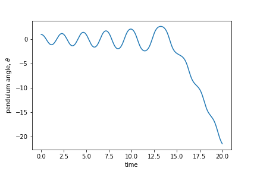
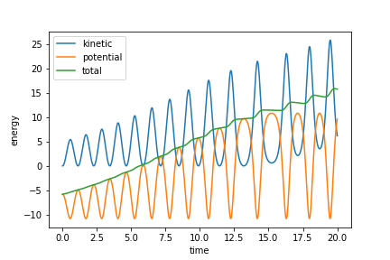

# DiffEqA

Numerical integrator for differential equations for a pendulum:
$$\ddot \theta = - \frac{g}{L} \sin(\theta).$$
To simulate, we write this as two first order ODEs.
$$\dot \theta = \omega,$$
$$\dot \omega = - \frac{g}{L} \sin(\theta).$$
When integrated with Euler's method, here is our solution with $\theta$ versus time.

Obviously, something is wrong. The total energy should be constant, but it's increasing rapidly.

